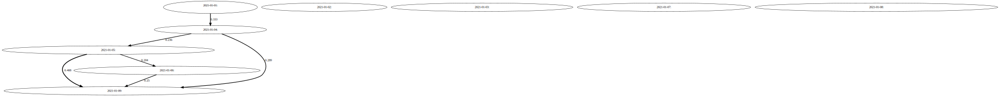

<!-- File: README.md                   -->
<!-- Copyright (C) ${DYEAR} by m.na.akei   -->
<!-- Time-stamp: "${DSTMP}" -->

[TOC]

# テキストマイニング用ツール #

テキストマイニング用のPythonツール郡のレポジトリ、と言っても断片的なもの。

## このレポジトリにあるもの

- CSVに含まれるテキストの正規化処理
- GiNZAによる日本語かかり受け解析 
- TFIDF処理によるCSVの各レコードの日本語文書の関連性分析
- 固有名詞候補として名詞の連続する語句を抽出
- 入力文書から語句テーブルを生成
- CSV形式の語句テーブルからMecab用辞書入力ファイルを生成
- CSV形式Mecab用辞書入力ファイルからMecab辞書を生成
- CSV形式の日本語文書をSolrに登録、検索


## スタートガイド
プロジェクトをローカルに複製して、検証、実行する手順を説明します

### 必要条件
OSは Ubuntu 20 において開発、動作確認を実施している。 その他の必要なパッケージは以下の通り。

- Python 3.8.10
- python packages:  
  jaconv, MeCaB,  numy, pandas, urllib3, sklearn.feature_extraction.text, sklearn.metrics.pairwise, ginza, spacy, deplacy, pykakasi, kanjize, neologdn
- Linux packages:  
  mecab, grahviz


### インストール

git cloneでダウンロードした後に、環境変数PYTHONPATHに、textminingディレクトリを追加し、`textmining`ディレクトリにPATHを設定する。 
又は選択したものをPATHの設定されたディレクトリにコピーして使用する。


```bash
git clone git@github.com:maundergit/textmining.git
export PYTHONPATH=$(pwd)/textming:${PYTHONPATH}
export PATH=$(pwd)/textming:${PATH}
```

`examples`ディレクトリに移動して、以下のコマンドを実行することにより、
文書間の関連性をグラフ化したGraphvizのDOT形式ファイルが得られる。

```bash
head wagahaiwa_nekodearu.csv | csv_text_tfidf.py --index date --output_mode dot --dot_cut_off=0 - content
```




### ツールのリスト

各コマンドのヘルプメッセージを [python_tool](python_tools.md)と[sh_tools](sh_tools.md)にまとめている。


## 作者

- m.na.akei - [maundergit](https://github.com/maundergit)

## ライセンス
This project is licensed under the MIT License - see the [LICENSE](LICENSE) file for details

このプロジェクトは MIT License のもとで公開しています。詳しくは[LICENSE](LICENSE) を参照してください。

## 謝辞

日本語の文書処理については、大勢の方が研究、開発を進めた成果が広く公開されたものを利用させていただきました。
一昔前は、アルファベットから構成される英語に比べれば難易度が高いようで、
利用できる環境どころかなかなか情報が入手できず断念しいたようなことが、かなり簡単にできるようになりました。


## 参考にしたサイト


- [Pythonの正規表現で漢字・ひらがな・カタカナ・英数字を判定・抽出・カウント \| note\.nkmk\.me](https://note.nkmk.me/python-re-regex-character-type/)
- [日本語テキストの前処理：neologdn、大文字小文字、Unicode正規化 \- tuttieee’s blog](https://tuttieee.hatenablog.com/entry/ja-nlp-preprocess)
- [mecabで半角記号が名詞,サ変接続になるのを解決する ： nymemo](https://nymemo.com/mecab/564/)
- [Pythonで文章の類似度を計算する方法〜TF\-IDFとcos類似度〜 \| データサイエンス情報局](https://analysis-navi.com/?p=688)
- [【sklearn】TfidfVectorizerの使い方を丁寧に \- gotutiyan’s blog](https://gotutiyan.hatenablog.com/entry/2020/09/10/181919)
- [scikit\-learnのCountVectorizerやTfidfVectorizerで追加学習させる \| ITに頼って生きていく](https://boomin.yokohama/archives/1468)
- [日本語 Universal Dependencies の試案](https://www.anlp.jp/proceedings/annual_meeting/2015/pdf_dir/E3-4.pdf)
- [自然言語処理ライブラリのGiNZAを使って係り受け解析を試す](https://www.virment.com/ginza-dependency-parse/)
- [GiNZAを使って係り受け解析をやってみる \- Re:ゼロから始めるML生活](https://www.nogawanogawa.com/entry/ginza-2)
- [GiNZA\+Elasticsearchで係り受け検索の第一歩 \- Taste of Tech Topics](https://acro-engineer.hatenablog.com/entry/2019/12/06/120000)
- [何もない所から一瞬で、自然言語処理と係り受け解析をライブコーディングする手品を、LTでやってみた話 \- Qiita](https://qiita.com/youwht/items/b047225a6fc356fd56ee)
- [Visualizers · spaCy Usage Documentation](https://spacy.io/usage/visualizers)
- [Apache Solr Reference Guide \| Apache Solr Reference Guide 8\.9](https://solr.apache.org/guide/8_9/)


<!-- ------------------ -->
<!-- Local Variables:   -->
<!-- mode: markdown     -->
<!-- coding: utf-8-unix -->
<!-- End:               -->
